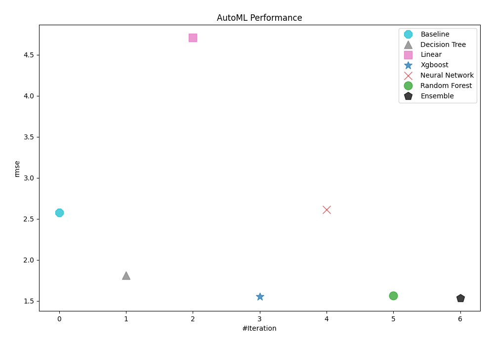

# AutoML Leaderboard

| Best model   | name                                                         | model_type     | metric_type   |   metric_value |   train_time |
|:-------------|:-------------------------------------------------------------|:---------------|:--------------|---------------:|-------------:|
|              | [1_Baseline](1_Baseline/README.md)                           | Baseline       | rmse          |        2.577   |         0.35 |
|              | [2_DecisionTree](2_DecisionTree/README.md)                   | Decision Tree  | rmse          |        1.81187 |         5.65 |
|              | [3_Linear](3_Linear/README.md)                               | Linear         | rmse          |        4.70581 |         6.19 |
|              | [4_Default_Xgboost](4_Default_Xgboost/README.md)             | Xgboost        | rmse          |        1.55417 |         7.59 |
|              | [5_Default_NeuralNetwork](5_Default_NeuralNetwork/README.md) | Neural Network | rmse          |        2.61273 |         3.76 |
|              | [6_Default_RandomForest](6_Default_RandomForest/README.md)   | Random Forest  | rmse          |        1.56674 |         6.78 |
| **the best** | [Ensemble](Ensemble/README.md)                               | Ensemble       | rmse          |        1.53689 |         0.08 |

### AutoML Performance
