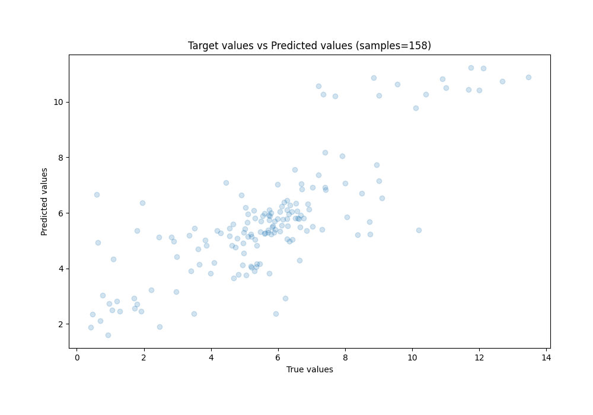
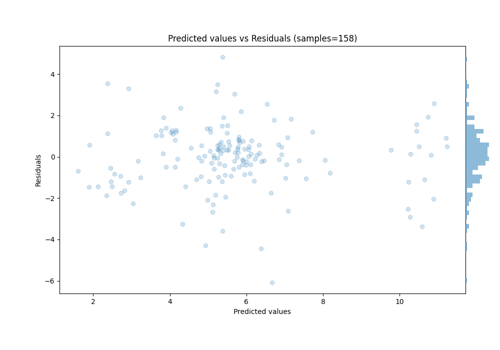

# Summary of Ensemble

[<< Go back](../README.md)

## Ensemble structure
| Model                  |   Weight |
|:-----------------------|---------:|
| 4_Default_Xgboost      |        3 |
| 6_Default_RandomForest |        2 |

### Metric details:
| Metric   |    Score |
|:---------|---------:|
| MAE      | 1.11556  |
| MSE      | 2.36204  |
| RMSE     | 1.53689  |
| R2       | 0.642877 |
| MAPE     | 0.437943 |

## Learning curves

## True vs Predicted

## Predicted vs Residuals

[<< Go back](../README.md)
